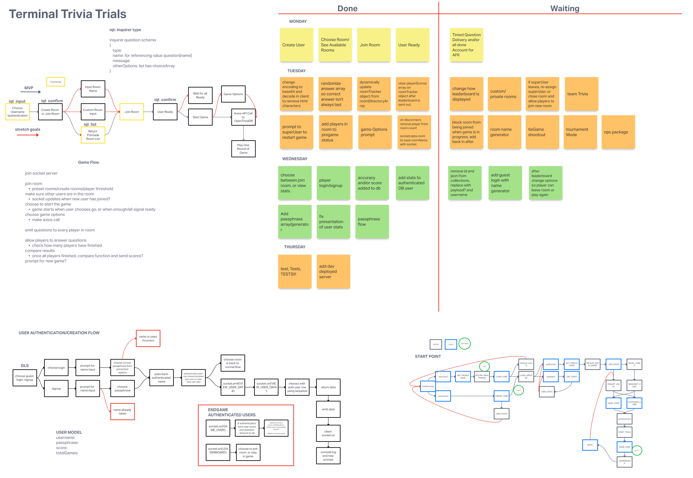

# Terminal Trivia Trials - server

This is a [group project](https://github.com/team-socket/Terminal-Trivia-Trials) I participated in at Code Fellows. It is a Command Line Only project.

[Client Repo link](https://github.com/j-davitt/trivia-backend-client)

Some of my personal contributions include:

- Created the user model for data storage.
- Utilized Socket.io to to enable communication between the server and client.
- Created interactivity through the CLI with Inquirer.
- Utilized base64 decoding the properly display the data from OpenTriviaDB.
- Created room tracking functionality to support user roles.
- Participated in daily pair programming sessions.

## STARTUP

Use `node index.js` to start the server.

Use `npm install` to install required node_modules.

## Overview

 Authors: Joe Davitt, Brandon Perard, Adrienne Frey, Jonathan Staib

  Multiplayer Trivia is a game of trivia that utilizes socket.io and an open trivia database. It allows us to make a project without a Front-End that allows users to interact with eachother in real time. You will go through a level of authorization and your user data will be stored within our database.

## Process & Documentation

This is our Invision board we used during our initial planning/wireframing, for our daily tasks Kanban board, and for developing and wireframing new features. It also includes the flowchart for the interactions of our entire app.

